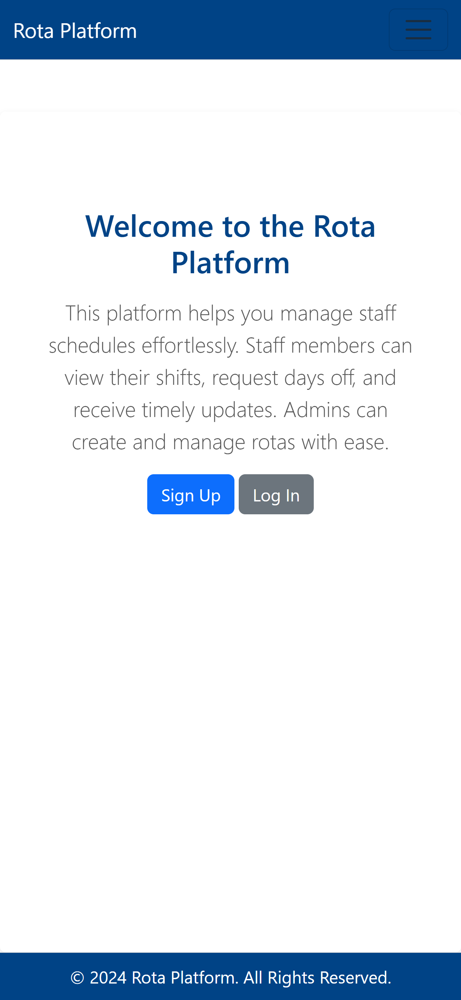
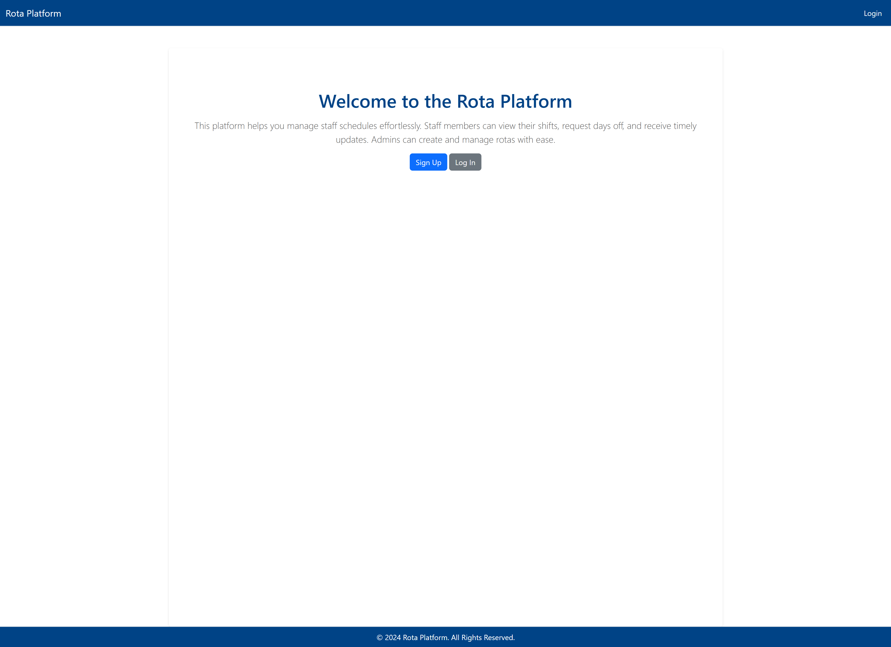
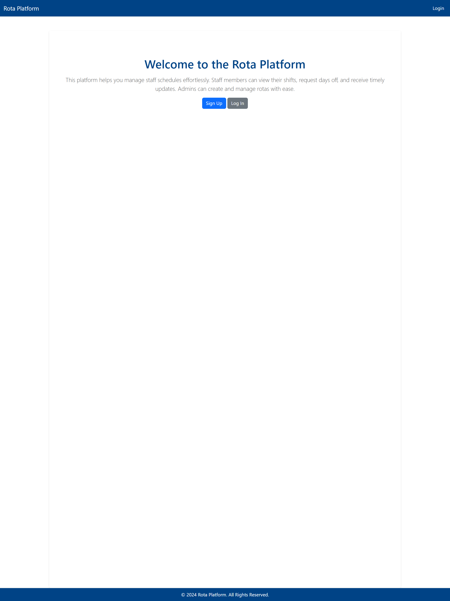
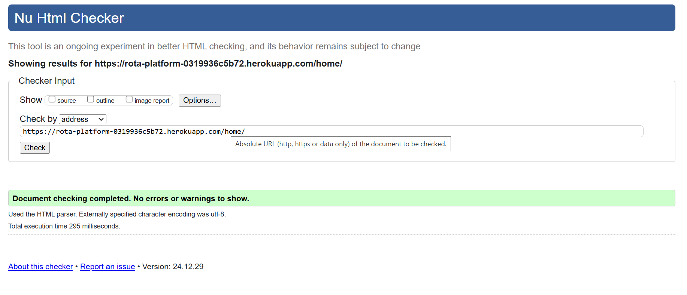
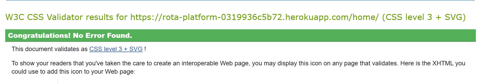

# Staff Rota Platform

The Rota Platform is a full-stack web -based application which runs in the Code Institute mock terminal on Heroku.

The application is designed for user to see their allocated working schedule which was created for them by the admin/manager. The application is intended for rota schedule creation, profile management and day off requests. 

The application was build using Django which offers and intuitive interface for both administrators and staff members

[Here is a link to my live version of my project](https://rota-platform-0319936c5b72.herokuapp.com/)

- Phone 

- Desktop

- Tablet

## How the app works
- Admin credentials were created using the create superuser command in the terminal. A superuser cannot be deleted. His details can be changed to reflect the new account. 
- I have created Assesor Admin and a Assessor User account for the project submission. The credentials will be addedd to the submission page 
- The superuser can give credentials to other user to login to the admin page. 
- When a user open the webpage the will see the home page. 
- In the home page there are two buttons. One for Sign Up and another one for Login. 
- If a user already has an account they will login into the site. If they don't have an account they can create their own account.

## Features

- **User Registration & Authentication**  
  - Secure sign-up and sign-in functionality.  
  - Admin and standard staff roles with appropriate permissions.

- **Shift Scheduling**  
  - Admin can add, edit, and delete staff shifts.  
  - Staff can view their weekly rota and can view already worked shifts

- **Absence & Sickness Management**  
  - Staff cab use the platform to send a request for a day off and write and explanation about why or they can inform the admin about sickness absence through the request.
  - The admin can add the request to the rota and can add sickness/absence to the rota which will display in the weekly roat and on the staff dashboard when they login  
  - Admin can approve or reject requests, automatically updating the schedule.

- **Responsive Design**  
  - Optimized to provide a consistent experience across desktops, tablets, and mobile devices.

## UI & UX

1. **Color Palette**  
   - *Primary Color*: `#4A90E2` (used for key actions, such as buttons and headers)  
   - *Secondary Color*: `#D0021B` (used for alerts or warnings)
   - *Primary nav-bar and table header color: `#004386` 
   - *Neutral Palette*: 
     - White `#FFFFFF` (backgrounds),  
     - Light Gray `#F4F4F4` (sections, forms),  
     - Dark Gray `#333333` (text and navigation links)

2. **Design Approach**  
   - **User-Centered**: Quick navigation links for the most common tasks (view shifts, request a day off).  
   - **Clarity & Consistency**: Reusable components (buttons, forms) have consistent styling for intuitive interaction.  
   - **Accessibility**: Proper contrast, larger click areas, and descriptive alt text for images/icons.

3. **User Flow**  
   - **Admin**:
     1. Log in to the admin dashboard.  
     2. Create or modify staff rotas.  
     3. Approve or reject time-off requests.  
   - **Staff**:
     1. Log in to view personal rota.  
     2. Request time off or mark sickness.  
     3. Check passed work shifts

## Tech Stack

- **Python 3 & Django**: For the back-end logic and data handling.  
- **HTML, CSS, JavaScript**: For front-end templates and styling.  
- **PostgreSQL** For database storage.  
- **Gunicorn**: As the WSGI server for Heroku deployment.  
- **Heroku**: Hosting platform for production.

## Testing

#### I have manually tested the code

- I have passed the code through PEP8 linter and confirmed there are no problems
- Tested in my local terminal and in the Code Institute Heroku terminal

- Because of time constraints onLy the Models were automaticly tested.

### Bugs

#### Bugs found

- I found that the message when a profile was updated is displayed on the login page instead of the staff dashboard.

#### Remaining bugs

- The message continues to be displayed on the login page. The message will dissapear if the page is reloaded.

### Validator testing

- PEP8
    - No errors were returned on [PEP8online.com](https://pep8ci.herokuapp.com/)
- HTML
    - No errors were returned on [validator.w3.org/](https://validator.w3.org/)
    
- CSS
    - No errors were returned on [jigsaw.w3.org](https://jigsaw.w3.org/)
    

## Deployment

The main branch of this repository is the most current version and has been used for the deployed version of the site.
The Code Institute student template was used to create this project.

[Code Institute Template](https://github.com/Code-Institute-Org/p3-template)

1. Click **Use This Template** button.
2. Give your repository a name, and description.
3. Open [Github](https://github.com/) and log into your account.
4. Click **New Workspace** button.
5. Create a workspace from your project repository by creating a clone.

### How to deploy using Heroku

The project was deployed using Code Institute's mock terminal for Heroku 
1. Create new Heroku app
2. Set the buildbacks for Python and Node.JS in that order 
3. Link the Heroku app to your Github repository
4. Click on Deploy Branch
5. After Heroku installed all requirements click View

### Creating a clone

1. From the repository, click **Code**.
2. In the **Clone >> HTTPS** section, copy the clone URL for the repository.
3. Paste a link into the designated area on the github. 

### Forking

1. From the repository, click **Fork**.
2. Give your repository a name.
3. Click **Create fork**.

## Credits
- Code Institute for the deployment terminal
- YouTube, ChatGPT, Google, Slack Overflow for various code assistance 