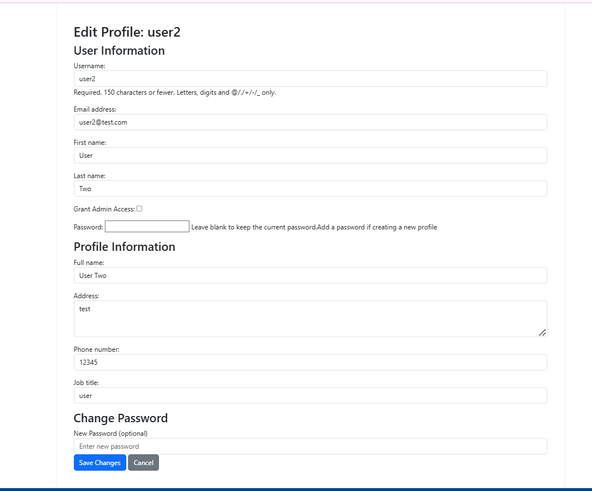

# Staff Rota Platform

The Rota Platform is a full-stack web -based application which runs in the Code Institute mock terminal on Heroku.

The application is designed for user to see their allocated working schedule which was created for them by the admin/manager. The application is intended for rota schedule creation, profile management and day off requests.

The application was build using Django which offers and intuitive interface for both administrators and staff members

[Here is a link to my live version of my project](https://rota-platform-0319936c5b72.herokuapp.com/)

## Responsive Views

- **Phone**  
  
- **Desktop**  
  
- **Tablet**  
  

---

## How the App Works

- **Admin Credentials:**  
  Created using the `createsuperuser` command in the terminal. A superuser (whose details can be modified but not deleted) is available by default.
- **Submission Accounts:**  
  For project submission, Assessor Admin and Assessor User accounts have been created; their credentials are provided on the submission page.
- **User Flow:**  
  When a user opens the webpage, they see the home page with two buttons – one for **Sign Up** and one for **Login**.
  - Existing users log in.
  - New users can create their own account.
  - The superuser can grant credentials to other users to enable them to log in to the admin page.

---
## Data Schema and Relationships

The Staff Rota Platform uses several key models to manage its data. This section describes the purpose of each model and how they relate to one another.

### Models Overview

1. **User**  
   This is Django's built‑in authentication user model. In addition to the standard fields (e.g., username, first_name, last_name, email), it is used as the base for extending staff information via related models.
   
   **Relationships:**
   - **One-to-One:** Each User has one associated **StaffProfile** (via a OneToOneField with `related_name='profile'`).
   - **One-to-Many:** Each User can have many **Rota** entries.
   - **One-to-Many:** Each User can have many **Request** objects.

2. **StaffProfile**  
   Stores extended information about a staff member, such as full name, address, email, phone number, and job title.
   
   **Key Fields:**
   - `full_name`
   - `address`
   - `email`
   - `phone_number`
   - `job_title`
   
   **Relationships:**
   - **One-to-One:** Linked to one **User**. The profile is automatically created (using Django signals) whenever a new User is created.

3. **Rota**  
   Represents the shift schedule entry for a user. Each rota entry details the assigned shift for a given date.
   
   **Key Fields:**
   - `user` (ForeignKey to User)
   - `date` (DateField)
   - `shift_type` (CharField with choices such as "Long Day", "Early", etc.)
   - `sickness_or_absence_type` (CharField, optional)
   - `start_time` (TimeField, optional)
   - `end_time` (TimeField, optional)
   - `is_updated` (BooleanField – indicates if the entry has been updated)
   
   **Relationships:**
   - **ForeignKey:** Each Rota entry is associated with one **User**.

4. **Request**  
   Handles day‑off or absence requests submitted by staff members. It includes details such as the request date, comments from the user, and the status of the request.
   
   **Key Fields:**
   - `user` (ForeignKey to User)
   - `date` (DateField)
   - `comment` (TextField – staff input)
   - `status` (CharField with choices "Pending", "Approved", "Rejected"; default is "Pending")
   - `admin_comment` (TextField – optional admin input)
   - `created_at` (DateTimeField, auto‑populated when the request is created)
   
   **Relationships:**
   - **ForeignKey:** Each Request is associated with one **User**.

---

## Features

- **User Registration & Authentication**

  - Secure sign‑up and sign‑in functionality.
  - Admin and standard staff roles with appropriate permissions.

- **Shift Scheduling**

  - Admins can add, edit, and delete staff shifts.
  - Staff can view their weekly rota and see completed shifts.

- **Absence & Sickness Management**

  - Staff can submit requests for a day off (with an explanation) or report sickness.
  - The admin can add sickness/absence entries to the rota.
  - Admins can approve or reject requests, automatically updating the schedule.

- **Responsive Design**
  - Optimized to provide a consistent user experience across desktops, tablets, and mobile devices.

---

## UI & UX

### Color Palette

- **Primary Color:** `#4A90E2` (used for key actions such as buttons and headers)
- **Secondary Color:** `#D0021B` (used for alerts or warnings)
- **Navbar & Table Header:** `#004386`
- **Neutral Palette:**
  - White: `#FFFFFF` (backgrounds)
  - Light Gray: `#F4F4F4` (sections, forms)
  - Dark Gray: `#333333` (text and navigation links)

### Design Approach

- **User‑Centered:**  
  Quick navigation links for common tasks (view shifts, request a day off).
- **Clarity & Consistency:**  
  Reusable components (buttons, forms) have consistent styling for an intuitive interaction.
- **Accessibility:**  
  Proper contrast, larger clickable areas, and descriptive alt text for images/icons.

### User Flow

- **Admin:**

  1. Log in to the admin dashboard.
  2. Create or modify staff rotas.
  3. Approve or reject day‑off requests.

- **Staff:**
  1. Log in to view their personal rota.
  2. Request time off or report sickness.
  3. Review past work shifts.

---

## Tech Stack

- **Backend:** Python 3 & Django 4.2.17
- **Frontend:** HTML, CSS, JavaScript, Bootstrap 5
- **Database:** PostgreSQL
- **Server:** Gunicorn for Heroku deployment
- **Hosting:** Heroku
- **Security:** django‑axes for enhanced authentication security

---

## Design & Wireframes

### Diagram

### Wireframe

#### Admin dashboard

#### Home page

#### Request Day Off

#### User Dashboard

#### Create rota

#### User Profiles

#### Weekly rota

#### Your Profile

## Testing

### Automated testing

- Admin dashboard
  

### Manual testing

- Tested in my local terminal and in the Code Institute Heroku terminal

| **Test Case ID** | **Test Title**                   | **Steps Summary**                                                                                                                                                                                                                    | **Expected Outcome**                                                                                                                                                                                                 |
| ---------------- | -------------------------------- | ------------------------------------------------------------------------------------------------------------------------------------------------------------------------------------------------------------------------------------ | -------------------------------------------------------------------------------------------------------------------------------------------------------------------------------------------------------------------- |
| **TC1.1** | Home Page Load | 1. Open the browser. 2. Navigate to `https://rota-platform-0319936c5b72.herokuapp.com`. | The homepage loads successfully showing the header, hero section with "Sign Up" and "Login" buttons, features/info section, and footer.|
| **TC2.1.1**| Invalid Login| 1. Navigate to `/login`. 2. Enter incorrect username and/or password. 3. Submit the form.| The login page reloads and displays an error message if incorrect username( "Username not found. Please try again.") for incorrect password will display("Wrong password. Please try again."); no redirection occurs.|
|
|
| **TC2.1.2**| Valid  Login| 1. Navigate to `/login`. 2. Enter valid admin credentials. 3. Submit the form.| The admin is logged in successfully and redirected to the admin dashboard  `/admin/dashboard`|
|
|
| **TC2.2.1**| Valid Staff Login| 1. Navigate to `/login`. 2. Enter valid credentials for a staff user. 3. Submit the form. | The staff user is logged in successfully and redirected to the staff dashboard `/dashboard`, where upcoming shifts and notifications are displayed.|
|
|
| **TC2.3.1**| Signup with Password Mismatch| 1. Navigate to `/signup`. 2. Fill out the registration form with mismatched 'Password' and 'Confirm Password' values. 3. Submit the form.| The registration form displays a validation error ("Passwords do not match") and prevents account creation.|
| **TC2.3.2**| Successful Signup| 1. Navigate to `/signup`. 2. Fill out the registration form with valid data and matching passwords. 3. Submit the form.| A success message ("Account created successfully. Please log in.") is shown, and the user is redirected to the login page to use their new credentials.|
|
| **TC3.1.1**| Create New Rota Entry (Admin)| 1. Log in as an admin. 2. Navigate to `/admin/create_rota`. 3. Fill in the rota form with valid staff data, a future date, a shift type, and start/end times. 4. Submit the form.| A new rota entry is created, confirmed by a success message, and appears on the admin dashboard and rota schedule.|
|
| **TC4.1.1**| Create New Staff Profile (Admin) | 1. Log in as an admin. 2. Navigate to `admin/create_staff_profile/`. 3. Complete the Account Information and Profile Details with valid details. 4. Submit the forms.| A new staff user account and corresponding profile are created; the admin is redirected to `/list_user_profiles` with a confirmation message.|
|
| **TC4.2.1**| Edit Existing Profile (Admin)| 1. Navigate to `/admin/list_profiles/`. 2. Select a specific user profile for editing. 3. Modify profile data using the edit form. 4. Submit the changes.| The updated profile information is saved and displayed correctly; a success message confirms the update.|
|
|
| **TC4.2.2**| Delete Non-Admin Profile (Admin) | 1. Navigate to `/admin/list_profiles/`. 2. Select a non-admin user's profile to delete. 3. Initiate the deletion action (e.g., press the delete button).| The selected user profile is deleted, with a confirmation message; deletion is prevented for admin profiles.|
|
| **TC5.1.1**| Request Day Off (Staff)| 1. Log in as a staff member. 2. Navigate to `/request_day_off`. 3. Complete the request form with a valid date and reason/comment. 4. Submit the form.| A success message confirms the submission; the day-off/sickness request is stored and later becomes visible to the admin for processing.|
|
| **TC5.2.1**| Staff Dashboard View | 1. Log in as a staff member. 2. Navigate to `/dashboard`.| The dashboard displays upcoming shifts.|
|
| **TC5.2.2**| View Completed Shifts| 1. Log in as a staff member. 2. Navigate to `/completed_shifts`.| A list of past shifts (with dates prior to today) is displayed, usually in descending order.|
|
| **TC6.1**| Process Staff Request (Admin)| 1. Log in as an admin. 2. Navigate to `/admin/dashboard`. 3. Select a pending day-off or sickness request. 4. Approve or reject the request. 5. Submit the decision.| The request status is updated (to "Approved" or "Rejected"), with a confirmation message displayed.|
| **TC7.1.1**| Weekly Rota View (Admin)| 1. Log in as an admin. 2. Navigate to `/weekly_rotas`.| A weekly calendar or table is displayed showing rota entries grouped by date and staff, providing an overview of scheduled shifts for the current and upcoming weeks.|
|
| **TC7.1.2**| Your Profile| 1. Click the Your Profile `view_staff_profile/` link available in the navigation bar while logged in.| A table with information about the user will be displayed. This if for both user and admin|
|
| **TC8.1**| Logout| 1. Click the logout link available in the navigation bar while logged in.| The user session ends, and the user is redirected to the home page; access to protected pages requires login.|

### Bugs

#### Bugs found

- I found that the message when a profile was updated is displayed on the login page instead of the staff dashboard.

#### Remaining bugs

- The message continues to be displayed on the login page. The message will dissapear if the page is reloaded.

### Validator testing

- PEP8
  - No errors were returned on [PEP8online.com](https://pep8ci.herokuapp.com/)
- HTML
  - No errors were returned on [validator.w3.org/](https://validator.w3.org/)
    
- CSS
  - No errors were returned on [jigsaw.w3.org](https://jigsaw.w3.org/)
    

## Deployment

The main branch of this repository is the most current version and has been used for the deployed version of the site.
The Code Institute student template was used to create this project.

[Code Institute Template](https://github.com/Code-Institute-Org/p3-template)

1. Click **Use This Template** button.
2. Give your repository a name, and description.
3. Open [Github](https://github.com/) and log into your account.
4. Click **New Workspace** button.
5. Create a workspace from your project repository by creating a clone.

### Deploy using Heroku

- Navigate to heroku and create an account.
- Click Create new app, enter the app name and choose your region, hit create app.
- Click Deploy and in the Deployment method option choose Github. Enter the repository's name and click connect, you can leave the branch deployment to main.
- You need to have created your github repository.

- Head to Settings and click Reveal config vars
- On the KEY inputs add: DATABASE_URL - SECRET_KEY. On the VALUE inputs add your own, for each one.
- Click Add buildpack and choose python.
- Now you're set. Go back to Deploy and click Deploy branch.

#### Inside settings.py

#### Inside env.py file

### Creating a clone

1. From the repository, click **Code**.
2. In the **Clone >> HTTPS** section, copy the clone URL for the repository.
3. Paste a link into the designated area on the github.

### Forking

1. From the repository, click **Fork**.
2. Give your repository a name.
3. Click **Create fork**.

## Credits

- Code Institute for the deployment terminal
- YouTube, ChatGPT, Google, Slack Overflow for various code assistance
