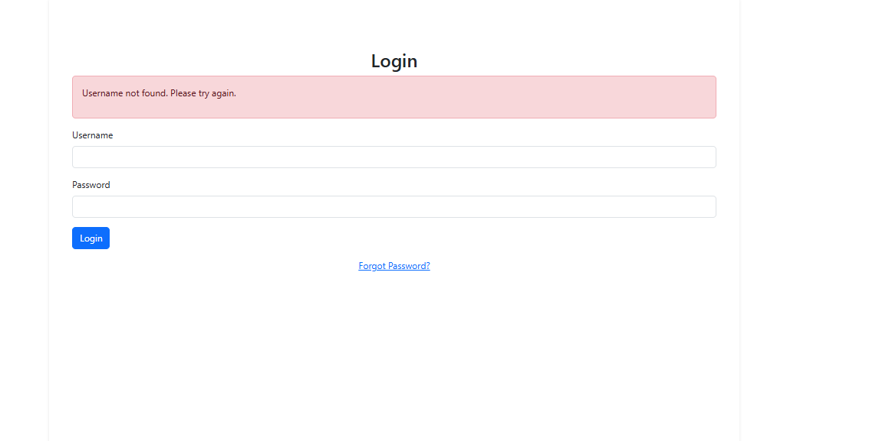

# Staff Rota Platform

The Rota Platform is a full-stack web -based application which runs in the Code Institute mock terminal on Heroku.

The application is designed for user to see their allocated working schedule which was created for them by the admin/manager. The application is intended for rota schedule creation, profile management and day off requests. 

The application was build using Django which offers and intuitive interface for both administrators and staff members

[Here is a link to my live version of my project](https://rota-platform-0319936c5b72.herokuapp.com/)

## Responsive Views

- **Phone**  
  
- **Desktop**  
  
- **Tablet**  
  

---

## How the App Works

- **Admin Credentials:**  
  Created using the `createsuperuser` command in the terminal. A superuser (whose details can be modified but not deleted) is available by default.
- **Submission Accounts:**  
  For project submission, Assessor Admin and Assessor User accounts have been created; their credentials are provided on the submission page.
- **User Flow:**  
  When a user opens the webpage, they see the home page with two buttons – one for **Sign Up** and one for **Login**.  
  - Existing users log in.
  - New users can create their own account.
  - The superuser can grant credentials to other users to enable them to log in to the admin page.

---

## Features

- **User Registration & Authentication**  
  - Secure sign‑up and sign‑in functionality.
  - Admin and standard staff roles with appropriate permissions.

- **Shift Scheduling**  
  - Admins can add, edit, and delete staff shifts.
  - Staff can view their weekly rota and see completed shifts.

- **Absence & Sickness Management**  
  - Staff can submit requests for a day off (with an explanation) or report sickness.
  - The admin can add sickness/absence entries to the rota.
  - Admins can approve or reject requests, automatically updating the schedule.

- **Responsive Design**  
  - Optimized to provide a consistent user experience across desktops, tablets, and mobile devices.

---

## UI & UX

### Color Palette

- **Primary Color:** `#4A90E2` (used for key actions such as buttons and headers)
- **Secondary Color:** `#D0021B` (used for alerts or warnings)
- **Navbar & Table Header:** `#004386`
- **Neutral Palette:**  
  - White: `#FFFFFF` (backgrounds)  
  - Light Gray: `#F4F4F4` (sections, forms)  
  - Dark Gray: `#333333` (text and navigation links)

### Design Approach

- **User‑Centered:**  
  Quick navigation links for common tasks (view shifts, request a day off).
- **Clarity & Consistency:**  
  Reusable components (buttons, forms) have consistent styling for an intuitive interaction.
- **Accessibility:**  
  Proper contrast, larger clickable areas, and descriptive alt text for images/icons.

### User Flow

- **Admin:**  
  1. Log in to the admin dashboard.  
  2. Create or modify staff rotas.  
  3. Approve or reject day‑off requests.

- **Staff:**  
  1. Log in to view their personal rota.  
  2. Request time off or report sickness.  
  3. Review past work shifts.

---

## Tech Stack

- **Backend:** Python 3 & Django 4.2.17  
- **Frontend:** HTML, CSS, JavaScript, Bootstrap 5  
- **Database:** PostgreSQL  
- **Server:** Gunicorn for Heroku deployment  
- **Hosting:** Heroku  
- **Security:** django‑axes for enhanced authentication security

---

## Design & Wireframes

### Diagram

### Wireframe

#### Admin dashboard

#### Home page

#### Request Day Off

#### User Dashboard

#### Create rota

#### User Profiles

#### Weekly rota

#### Your Profile

## Testing

### Automated testing
  - Admin dashboard

### Manual testing

#### I have manually tested the code

- I have passed the code through PEP8 linter and confirmed there are no problems
- Tested in my local terminal and in the Code Institute Heroku terminal

- Because of time constraints onLy the Models were automaticly tested.
- I complated manual testing on all pages and forms

  - Admin dashboard

  - Create staff profile form

  - Change password page

  - Complete shifts page

  - Create roat form

  - Create staff profile form

  - Delete profile alert

  - Edit profile form

  - Forgot password page

  - Login page

  - Request page

  - Signup form

  - User dashboard

  - User not found message

  - View all user

  - View my shifts page

  - Weekly rota

  - Message when wrong password is entered more than 5 times

  - Wrong password message

  - Your profile page

### Bugs

#### Bugs found

- I found that the message when a profile was updated is displayed on the login page instead of the staff dashboard.

#### Remaining bugs

- The message continues to be displayed on the login page. The message will dissapear if the page is reloaded.

### Validator testing

- PEP8
    - No errors were returned on [PEP8online.com](https://pep8ci.herokuapp.com/)
- HTML
    - No errors were returned on [validator.w3.org/](https://validator.w3.org/)
    
- CSS
    - No errors were returned on [jigsaw.w3.org](https://jigsaw.w3.org/)
    

## Deployment

The main branch of this repository is the most current version and has been used for the deployed version of the site.
The Code Institute student template was used to create this project.

[Code Institute Template](https://github.com/Code-Institute-Org/p3-template)

1. Click **Use This Template** button.
2. Give your repository a name, and description.
3. Open [Github](https://github.com/) and log into your account.
4. Click **New Workspace** button.
5. Create a workspace from your project repository by creating a clone.

### How to deploy using Heroku

The project was deployed using Code Institute's mock terminal for Heroku 
1. Create new Heroku app
2. Set the buildbacks for Python and Node.JS in that order 
3. Link the Heroku app to your Github repository
4. Click on Deploy Branch
5. After Heroku installed all requirements click View

### Creating a clone

1. From the repository, click **Code**.
2. In the **Clone >> HTTPS** section, copy the clone URL for the repository.
3. Paste a link into the designated area on the github. 

### Forking

1. From the repository, click **Fork**.
2. Give your repository a name.
3. Click **Create fork**.

## Credits
- Code Institute for the deployment terminal
- YouTube, ChatGPT, Google, Slack Overflow for various code assistance 